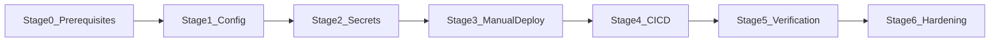

# First Deployment Plan — energy-monitor on Cloudflare Workers

This document is the authoritative checklist for the **first production deployment** of energy-monitor. It follows [infrastructure.md](../foundation/infrastructure.md) and [tech-stack.md](../foundation/tech-stack.md).

## Status legend

| Indicator | Meaning |
|---|---|
| `[ ]` | Not started |
| `[~]` | In progress |
| `[x]` | Done |
| `[!]` | Blocked |

Update the **Stage status** line and individual checkboxes as work progresses. Set `overall_status` in frontmatter to the lowest incomplete stage (e.g. `stage_2_secrets`).

## Deployment overview



| Stage | Name | Status |
|---|---|---|
| 0 | Prerequisites | `[x]` Done |
| 1 | Project configuration | `[x]` Done |
| 2 | Secrets & environment | `[x]` Done |
| 3 | First manual deploy | `[x]` Done |
| 4 | CI/CD pipeline | `[x]` Done |
| 5 | Verification & rollback | `[x]` Done |
| 6 | Post-deploy hardening | `[x]` Done (MVP — opcjonalne odłożone) |

**Target URL (after deploy):** `https://energy-monitor.kregielm.workers.dev`

---

## Stage 0 — Prerequisites

**Stage status:** `[x]` Done

### Accounts & tooling

- [x] Cloudflare account created (Workers Paid ~$5/mo recommended before real SSR traffic — see [Risk register](#risk-register))
  - Account: `Kregielm@gmail.com's Account` · ID: `2809ef7bc8c46894ed116c572199a5f9`
- [x] Wrangler authenticated locally (`npx wrangler whoami` → kregielm@gmail.com)
- [x] Node.js v22.14.0 installed (see `.nvmrc`) — detected **v22.22.0** (compatible)
- [x] Repository dependencies installed (`npm ci` — 2026-05-22)

### Supabase cloud project (production)

Use a **hosted Supabase project** for production — not the local Docker stack.

- [x] Create a Supabase project at [supabase.com/dashboard](https://supabase.com/dashboard) — credentials w `.env` / `.dev.vars`
- [x] Note **Project URL** and **anon public key** (Settings → API)
- [x] Configure auth for production:
  - [x] **Authentication → URL configuration** — `https://energy-monitor.kregielm.workers.dev` + `/**`
  - [x] Decide email confirmation policy: **wyłączone** (solo MVP)
- [x] (Optional) Apply migrations — **pominięte** (brak plików w `supabase/migrations/`)

### GitHub repository

- [x] Repository on GitHub — gałąź produkcyjna **`master`** (`energy-consumption-guard`)
  - Remote: `https://github.com/mkregiel/energy-consumption-guard.git`
  - `origin/master` opublikowany 2026-05-23; CI triggeruje `master`
- [x] You have admin access to configure repository secrets

### Local sanity check (before cloud deploy)

- [x] Copy env files for local dev (`.env`, `.dev.vars` utworzone 2026-05-22)
- [x] Fill `.env` / `.dev.vars` with **cloud** Supabase credentials
- [x] Dev server starts and auth pages load (`npm run dev` → `/`, `/auth/signin`, `/auth/signup` HTTP 200)

**Exit criteria:** Wrangler logged in, Supabase cloud project exists with credentials, local build path verified.

---

## Stage 1 — Project configuration

**Stage status:** `[x]` Done

### Worker identity

- [x] Rename Worker in [wrangler.jsonc](../../wrangler.jsonc): `"name": "energy-monitor"`

### SSR & adapter (verify — should already be correct)

- [x] [astro.config.mjs](../../astro.config.mjs): `output: "server"` and `adapter: cloudflare()`
- [x] [wrangler.jsonc](../../wrangler.jsonc):
  - [x] `main`: `@astrojs/cloudflare/entrypoints/server`
  - [x] `compatibility_flags`: includes `nodejs_compat`
  - [x] `assets.directory`: `./dist`
  - [x] `observability.enabled`: `true`

### Environment schema

- [x] [astro.config.mjs](../../astro.config.mjs) declares server secrets: `SUPABASE_URL`, `SUPABASE_KEY`
- [x] No secrets committed — `.env`, `.dev.vars` remain gitignored

### Build validation

- [x] Lint passes (`npm run lint` — 2026-05-22)
- [x] Production build succeeds locally (`npm run build` — 2026-05-22)

**Exit criteria:** Worker name is `energy-monitor`, lint + build green locally.

---

## Stage 2 — Secrets & environment

**Stage status:** `[x]` Done

Secrets live in **two places**: Cloudflare (runtime) and GitHub (CI build + deploy).

### Cloudflare runtime secrets

Set via CLI (recommended) or Cloudflare dashboard → Workers → energy-monitor → Settings → Variables and Secrets.

- [x] `SUPABASE_URL` — production Supabase project URL
- [x] `SUPABASE_KEY` — Supabase **anon** public key (matches README; never commit service role to client-facing Worker unless explicitly reviewed)

```powershell
npx wrangler secret put SUPABASE_URL
npx wrangler secret put SUPABASE_KEY
```

### GitHub repository secrets

Configure at **Settings → Secrets and variables → Actions**.

| Secret | Purpose | Status |
|---|---|---|
| `SUPABASE_URL` | CI build (`astro build`) | `[x]` |
| `SUPABASE_KEY` | CI build | `[x]` |
| `CLOUDFLARE_API_TOKEN` | CI deploy via Wrangler | `[x]` |
| `CLOUDFLARE_ACCOUNT_ID` | CI deploy via Wrangler | `[x]` |

#### Creating `CLOUDFLARE_API_TOKEN`

- [x] Cloudflare dashboard → My Profile → API Tokens → Create Token
- [x] Use **Edit Cloudflare Workers** template (or custom token with `Account.Workers Scripts:Edit` + `Account.Account Settings:Read`)
- [x] Scope to the target account only
- [x] Store token as GitHub secret `CLOUDFLARE_API_TOKEN`

#### Finding `CLOUDFLARE_ACCOUNT_ID`

- [x] Cloudflare dashboard → Workers & Pages → right sidebar **Account ID**
- [x] Store as GitHub secret `CLOUDFLARE_ACCOUNT_ID`

**Exit criteria:** All four GitHub secrets set; Cloudflare Worker secrets set via `wrangler secret put`.

---

## Stage 3 — First manual deploy

**Stage status:** `[x]` Done

Perform the **first deploy manually** before enabling CI/CD — validates Wrangler, secrets, and Supabase connectivity without pipeline variables masking errors.

### Deploy

- [x] Build:
  ```powershell
  npm run build
  ```
- [x] Deploy:
  ```powershell
  npx wrangler deploy
  ```
- [x] Note the deployed URL from Wrangler output (e.g. `https://energy-monitor.<account>.workers.dev`)
  - **URL:** `https://energy-monitor.kregielm.workers.dev` · Version: `913d934a-be5d-4180-b1a3-e631cfb751f9`

### Smoke tests

- [x] **Home / public pages** — HTTP 200, SSR HTML renders (no 500)
- [x] **Static assets** — CSS/JS load (no 404 on fingerprinted chunks)
- [x] **Auth sign-up** — `/api/auth/signup` → 302 `/auth/confirm-email` (user created in Supabase)
- [x] **Auth sign-in** — `/api/auth/signin` → 302 `/` (sesja ustawiona)
- [x] **Protected route** — `/dashboard` redirects to sign-in when logged out (302); HTTP 200 when logged in
- [x] **Sign-out** — 302 `/`, potem `/dashboard` → 302 `/auth/signin`

### Observability (initial)

- [x] Tail logs during smoke test:
  ```powershell
  npx wrangler tail energy-monitor
  ```
- [x] Confirm no repeated Supabase connection errors in output (GET `/`, `/auth/signin`, `/dashboard` — Ok, brak błędów)

**Exit criteria:** Production Worker URL serves the app; auth end-to-end works against Supabase cloud.

---

## Stage 4 — CI/CD pipeline

**Stage status:** `[x]` Done

Extend [.github/workflows/ci.yml](../../.github/workflows/ci.yml) so merges to `master` auto-deploy after lint + build pass. PRs continue to lint + build only (no deploy).

### Workflow changes

- [x] Add a `deploy` job that:
  - runs only on `push` to `master` (not on `pull_request`)
  - `needs: ci` (waits for lint + build)
  - uses `cloudflare/wrangler-action@v3` or equivalent `npx wrangler deploy`
  - passes `CLOUDFLARE_API_TOKEN` and `CLOUDFLARE_ACCOUNT_ID`
  - optionally re-runs `npm run build` with `SUPABASE_URL` / `SUPABASE_KEY` for a fresh artifact

Example deploy job skeleton:

```yaml
deploy:
  runs-on: ubuntu-latest
  needs: ci
  if: github.event_name == 'push' && github.ref == 'refs/heads/master'
  steps:
    - uses: actions/checkout@v4
    - uses: actions/setup-node@v4
      with:
        node-version: 22
        cache: npm
    - run: npm ci
    - run: npx astro sync
    - run: npm run build
      env:
        SUPABASE_URL: ${{ secrets.SUPABASE_URL }}
        SUPABASE_KEY: ${{ secrets.SUPABASE_KEY }}
    - uses: cloudflare/wrangler-action@v3
      with:
        apiToken: ${{ secrets.CLOUDFLARE_API_TOKEN }}
        accountId: ${{ secrets.CLOUDFLARE_ACCOUNT_ID }}
        command: deploy
```

### Validate pipeline

- [x] Open a PR — CI runs lint + build only; **no deploy** ([PR #1](https://github.com/mkregiel/energy-consumption-guard/pull/1), [run #26334615471](https://github.com/mkregiel/energy-consumption-guard/actions/runs/26334615471) — `ci` success, `deploy` **skipped**)
- [x] Merge/push to `master` — deploy job succeeds ([run #26334339802](https://github.com/mkregiel/energy-consumption-guard/actions/runs/26334339802))
- [x] Post-merge smoke test on production URL (repeat Stage 3 checks)

**Exit criteria:** Push to `master` triggers automated deploy; PRs do not deploy.

---

## Stage 5 — Verification & rollback

**Stage status:** `[x]` Done

Confirm operational controls documented in [infrastructure.md](../foundation/infrastructure.md).

### Production verification

- [x] Re-run full smoke test checklist from Stage 3 on the CI-deployed version
- [~] Cloudflare dashboard → Workers → energy-monitor → Metrics — requests visible (wymaga ręcznego sprawdzenia w dashboardzie)
- [~] Check CPU duration per request (watch for free-tier 10 ms limit — see risks) — wymaga dashboardu; Worker startup 18–25 ms przy deployu

### Rollback drill

- [x] List recent versions:
  ```powershell
  npx wrangler versions list
  ```
- [x] Deploy a trivial visible change (e.g. comment in a page), deploy, confirm live
  - Marker `rollback-drill-marker-20260523` → version `3daffbdb-f2d5-40f3-9230-02b8d6478e26`
- [x] Roll back to previous version:
  ```powershell
  npx wrangler rollback
  ```
  - Przywrócono `0e72487f-038c-4ebb-937e-151e61be922e` (CI deploy)
- [x] Confirm previous version is live and static assets still load (no chunk 404s)

### Log access

- [x] `npx wrangler tail energy-monitor` streams live logs
- [x] GitHub Actions deploy logs accessible via Actions tab ([run #26334339802](https://github.com/mkregiel/energy-consumption-guard/actions/runs/26334339802))

**Exit criteria:** Rollback tested successfully; observability confirmed.

---

## Stage 6 — Post-deploy hardening

**Stage status:** `[x]` Done (MVP)

Optional but recommended before inviting real users or connecting Tuya (FR-005).

### Custom domain (optional)

**Decyzja MVP (2026-05-23):** Odłożone — produkcja na `https://energy-monitor.kregielm.workers.dev`.

- [~] Register or transfer domain to Cloudflare DNS — **pominięte na MVP**
- [~] Workers → energy-monitor → Settings → Domains & Routes → add custom domain
- [~] Update Supabase **Site URL** and **Redirect URLs** to custom domain
- [~] Re-run auth smoke tests on custom domain

> Gdy dodasz domenę: zaktualizuj Supabase Auth URLs, wdróż ponownie i powtórz smoke testy z Etapu 3.

### Preview deployments (optional)

**Decyzja MVP (2026-05-23):** Odłożone — PR-y uruchamiają tylko `ci` (lint + build), bez preview URL.

- [~] Connect GitHub repo in Cloudflare dashboard (if not already) — repo połączone przez CI deploy token
- [~] Enable preview deployments per PR / branch alias — **pominięte** (prod Supabase na preview = ryzyko)
- [~] Protect preview URLs if they use production Supabase credentials (separate Supabase project or Cloudflare Access)

> Jeśli włączysz preview: użyj osobnego projektu Supabase lub Cloudflare Access; nigdy prod credentials na publicznych preview URL.

### Workers Paid plan

**Decyzja MVP (2026-05-23):** Free tier na start; monitoruj CPU ms w dashboardzie po pierwszym realnym ruchu.

- [x] Monitor CPU ms in dashboard after first real usage — [Workers → energy-monitor → Metrics](https://dash.cloudflare.com/)
- [~] Enable Workers Paid (~$5/mo) if SSR + Supabase round-trips exceed free CPU limits — **włącz gdy CPU/request > 10 ms lub billing alert**

### Operational runbook (document decisions)

- [x] **Secret rotation:**
  1. `npx wrangler secret put SUPABASE_URL` / `SUPABASE_KEY` (runtime)
  2. `gh secret set SUPABASE_URL` / `SUPABASE_KEY` (CI build)
  3. Push do `master` → auto-deploy, lub `npx wrangler deploy` ręcznie
  4. Smoke test auth na prod URL
- [x] **Emergency rollback:**
  1. `npx wrangler versions list` — znajdź stabilną wersję
  2. `npx wrangler rollback` — natychmiastowy revert (minuty)
  3. Smoke test stron + assety (`/_astro/*.css` → 200)
  4. Migracje Supabase **nie** cofają się z rollbackiem Workera
- [x] **Human approval gate:** Wymagaj ręcznej akceptacji przed:
  - rotacją sekretów produkcyjnych (Supabase, Cloudflare, Tuya)
  - zmianami RLS / migracjami Supabase
  - pierwszym podłączeniem credentiali Tuya (FR-005)
  - Auto-deploy z `master` jest OK dla zmian kodu aplikacji (bez sekretów/DB)

### Future: FR-005 cron (out of scope for first deploy)

When the limit-check API route exists, add to [wrangler.jsonc](../../wrangler.jsonc):

```jsonc
"triggers": {
  "crons": ["0 */1 * * *"]
}
```

Design the handler as idempotent and short-lived (Cron Trigger timeouts). Validate schedule in UTC.

**Exit criteria:** Domain/plan decisions documented; runbook entries filled in.

---

## Risk register

Mapped from [infrastructure.md](../foundation/infrastructure.md). Track mitigations during Stages 3–6.

| Risk | Likelihood | Impact | Mitigation | Status |
|---|---|---|---|---|
| Free-tier CPU exceeded by SSR + Supabase | High | Medium | Enable Workers Paid early; monitor CPU ms; cache read-heavy data where safe | `[~]` monitor |
| Rollback causes 404 on static assets | Low | Medium | Test rollback in Stage 5; prefer instant rollback for logic-only changes | `[x]` |
| Pages vs Workers naming confusion | Medium | Low | Use `wrangler deploy` (Workers), not legacy Pages-only guides | `[x]` |
| Supabase redirect URL mismatch | Medium | High | Set Site URL + Redirect URLs in Stage 0; retest after custom domain | `[x]` workers.dev |
| Missing GitHub / Cloudflare secrets break CI deploy | Medium | High | Complete Stage 2 checklist before Stage 4 | `[x]` |
| Tuya SDK incompatible with `workerd` | Medium | High | Spike locally via `npm run dev` before FR-005; fallback to external cron hitting API route | `[ ]` (future) |
| Cron job timeout on slow Tuya API | Medium | High | Short handlers, idempotency, store last reading in Supabase | `[ ]` (future) |

---

## Quick reference

| Action | Command |
|---|---|
| Local dev | `npm run dev` |
| Lint | `npm run lint` |
| Build | `npm run build` |
| Manual deploy | `npx wrangler deploy` |
| Live logs | `npx wrangler tail energy-monitor` |
| Rollback | `npx wrangler rollback` |
| List versions | `npx wrangler versions list` |
| Set secret | `npx wrangler secret put <NAME>` |

## Related files

- [wrangler.jsonc](../../wrangler.jsonc) — Worker name, assets, observability
- [astro.config.mjs](../../astro.config.mjs) — SSR output, Cloudflare adapter, env schema
- [.github/workflows/ci.yml](../../.github/workflows/ci.yml) — lint + build (deploy job added in Stage 4)
- [README.md](../../README.md) — setup and deployment overview
- [infrastructure.md](../foundation/infrastructure.md) — platform decision and ops story
- [tech-stack.md](../foundation/tech-stack.md) — stack metadata and CI expectations

---

## Deployment log

Record significant events here as stages complete.

| Date | Stage | Event | By |
|---|---|---|---|
| 2026-05-22 | — | Deploy plan created; all stages not started | — |
| 2026-05-22 | 0 | Auto-check: Cloudflare + Wrangler OK, Node v22.22.0, brak `.env`/`.dev.vars`, brak migracji Supabase | agent |
| 2026-05-22 | 0 | Etap 0 zamknięty — Supabase Auth URLs skonfigurowane | user |
| 2026-05-22 | 1 | Worker `energy-monitor`, lint + build OK | agent |
| 2026-05-23 | 2 | Wznowiono plan — Etap 2 rozpoczęty; brak sekretów GitHub; Worker CF jeszcze nie wdrożony | agent |
| 2026-05-23 | 2 | Ustawiono 4 sekrety GitHub z `.env` (SUPABASE_*, CLOUDFLARE_*) | agent |
| 2026-05-23 | 2 | Ustawiono sekrety CF runtime (`SUPABASE_URL`, `SUPABASE_KEY`) po deployu | agent |
| 2026-05-23 | 3 | Pierwszy deploy OK — `https://energy-monitor.kregielm.workers.dev`; smoke testy HTTP + signup OK | agent |
| 2026-05-23 | 3 | **Blokada:** sign-in zwraca „Email not confirmed” — wymaga korekty w Supabase Auth | agent |
| 2026-05-23 | 3 | Etap 3 zamknięty — auth E2E OK po wyłączeniu Confirm email w Supabase | agent |
| 2026-05-23 | 4 | Wznowiono Etap 4 — dodano job `deploy` (trigger `master`); oczekuje push | agent |
| 2026-05-23 | 4 | CI run #26334339802 — `ci` + `deploy` success; smoke test prod OK | agent |
| 2026-05-23 | 5 | Smoke test CI-deployed OK; rollback drill success (`3daffbdb` → `0e72487f`); tail + GH logs OK | agent |
| 2026-05-23 | 4 | PR #1 — `pull_request` event: `ci` success, `deploy` skipped (run #26334615471) | agent |
| 2026-05-23 | 6 | Etap 6 — runbook uzupełniony; custom domain / preview / Paid odłożone na MVP | agent |
