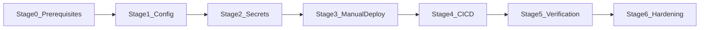

# First Deployment Plan — energy-monitor on Cloudflare Workers

This document is the authoritative checklist for the **first production deployment** of energy-monitor. It follows [infrastructure.md](../foundation/infrastructure.md) and [tech-stack.md](../foundation/tech-stack.md).

## Status legend

| Indicator | Meaning |
|---|---|
| `[ ]` | Not started |
| `[~]` | In progress |
| `[x]` | Done |
| `[!]` | Blocked |

Update the **Stage status** line and individual checkboxes as work progresses. Set `overall_status` in frontmatter to the lowest incomplete stage (e.g. `stage_2_secrets`).

## Deployment overview



| Stage | Name | Status |
|---|---|---|
| 0 | Prerequisites | `[ ]` Not started |
| 1 | Project configuration | `[ ]` Not started |
| 2 | Secrets & environment | `[ ]` Not started |
| 3 | First manual deploy | `[ ]` Not started |
| 4 | CI/CD pipeline | `[ ]` Not started |
| 5 | Verification & rollback | `[ ]` Not started |
| 6 | Post-deploy hardening | `[ ]` Not started |

**Target URL (after deploy):** `https://energy-monitor.<account-subdomain>.workers.dev`

---

## Stage 0 — Prerequisites

**Stage status:** `[ ]` Not started

### Accounts & tooling

- [ ] Cloudflare account created (Workers Paid ~$5/mo recommended before real SSR traffic — see [Risk register](#risk-register))
- [ ] Wrangler authenticated locally:
  ```powershell
  npx wrangler login
  ```
- [ ] Node.js v22.14.0 installed (see `.nvmrc`)
- [ ] Repository dependencies installed:
  ```powershell
  npm ci
  ```

### Supabase cloud project (production)

Use a **hosted Supabase project** for production — not the local Docker stack.

- [ ] Create a Supabase project at [supabase.com/dashboard](https://supabase.com/dashboard)
- [ ] Note **Project URL** and **anon public key** (Settings → API)
- [ ] Configure auth for production:
  - [ ] **Authentication → URL configuration**: add production Worker URL to **Site URL** and **Redirect URLs** (e.g. `https://energy-monitor.<account>.workers.dev/**`)
  - [ ] Decide email confirmation policy (on for production, or off for solo MVP — document the choice)
- [ ] (Optional) Apply any pending migrations from `supabase/migrations/` to the cloud project:
  ```powershell
  npx supabase link --project-ref <project-ref>
  npx supabase db push
  ```

### GitHub repository

- [ ] Repository pushed to GitHub with `master` as the default branch
- [ ] You have admin access to configure repository secrets

### Local sanity check (before cloud deploy)

- [ ] Copy env files for local dev:
  ```powershell
  Copy-Item .env.example .env
  Copy-Item .env.example .dev.vars
  ```
- [ ] Fill `.env` / `.dev.vars` with **cloud** Supabase credentials (or local stack for dev-only testing)
- [ ] Dev server starts and auth pages load:
  ```powershell
  npm run dev
  ```

**Exit criteria:** Wrangler logged in, Supabase cloud project exists with credentials, local build path verified.

---

## Stage 1 — Project configuration

**Stage status:** `[ ]` Not started

Align repo config with the energy-monitor project name and Cloudflare Workers SSR target.

### Worker identity

- [ ] Rename Worker in [wrangler.jsonc](../../wrangler.jsonc):
  ```jsonc
  "name": "energy-monitor"
  ```
  (Current default: `10x-astro-starter` — change before first deploy.)

### SSR & adapter (verify — should already be correct)

- [ ] [astro.config.mjs](../../astro.config.mjs): `output: "server"` and `adapter: cloudflare()`
- [ ] [wrangler.jsonc](../../wrangler.jsonc):
  - [ ] `main`: `@astrojs/cloudflare/entrypoints/server`
  - [ ] `compatibility_flags`: includes `nodejs_compat`
  - [ ] `assets.directory`: `./dist`
  - [ ] `observability.enabled`: `true`

### Environment schema

- [ ] [astro.config.mjs](../../astro.config.mjs) declares server secrets: `SUPABASE_URL`, `SUPABASE_KEY` (already present)
- [ ] No secrets committed — `.env`, `.dev.vars` remain gitignored

### Build validation

- [ ] Lint passes:
  ```powershell
  npm run lint
  ```
- [ ] Production build succeeds locally (use cloud Supabase values):
  ```powershell
  $env:SUPABASE_URL = "https://<project-ref>.supabase.co"
  $env:SUPABASE_KEY = "<anon-key>"
  npm run build
  ```

**Exit criteria:** Worker name is `energy-monitor`, lint + build green locally.

---

## Stage 2 — Secrets & environment

**Stage status:** `[ ]` Not started

Secrets live in **two places**: Cloudflare (runtime) and GitHub (CI build + deploy).

### Cloudflare runtime secrets

Set via CLI (recommended) or Cloudflare dashboard → Workers → energy-monitor → Settings → Variables and Secrets.

- [ ] `SUPABASE_URL` — production Supabase project URL
- [ ] `SUPABASE_KEY` — Supabase **anon** public key (matches README; never commit service role to client-facing Worker unless explicitly reviewed)

```powershell
npx wrangler secret put SUPABASE_URL
npx wrangler secret put SUPABASE_KEY
```

### GitHub repository secrets

Configure at **Settings → Secrets and variables → Actions**.

| Secret | Purpose | Status |
|---|---|---|
| `SUPABASE_URL` | CI build (`astro build`) | `[ ]` |
| `SUPABASE_KEY` | CI build | `[ ]` |
| `CLOUDFLARE_API_TOKEN` | CI deploy via Wrangler | `[ ]` |
| `CLOUDFLARE_ACCOUNT_ID` | CI deploy via Wrangler | `[ ]` |

#### Creating `CLOUDFLARE_API_TOKEN`

- [ ] Cloudflare dashboard → My Profile → API Tokens → Create Token
- [ ] Use **Edit Cloudflare Workers** template (or custom token with `Account.Workers Scripts:Edit` + `Account.Account Settings:Read`)
- [ ] Scope to the target account only
- [ ] Store token as GitHub secret `CLOUDFLARE_API_TOKEN`

#### Finding `CLOUDFLARE_ACCOUNT_ID`

- [ ] Cloudflare dashboard → Workers & Pages → right sidebar **Account ID**
- [ ] Store as GitHub secret `CLOUDFLARE_ACCOUNT_ID`

**Exit criteria:** All four GitHub secrets set; Cloudflare Worker secrets set via `wrangler secret put`.

---

## Stage 3 — First manual deploy

**Stage status:** `[ ]` Not started

Perform the **first deploy manually** before enabling CI/CD — validates Wrangler, secrets, and Supabase connectivity without pipeline variables masking errors.

### Deploy

- [ ] Build:
  ```powershell
  npm run build
  ```
- [ ] Deploy:
  ```powershell
  npx wrangler deploy
  ```
- [ ] Note the deployed URL from Wrangler output (e.g. `https://energy-monitor.<account>.workers.dev`)

### Smoke tests

- [ ] **Home / public pages** — HTTP 200, SSR HTML renders (no 500)
- [ ] **Static assets** — CSS/JS load (no 404 on fingerprinted chunks)
- [ ] **Auth sign-up** — `/auth/signup` creates a user in Supabase cloud
- [ ] **Auth sign-in** — `/auth/signin` succeeds, session cookie set
- [ ] **Protected route** — `/dashboard` redirects to sign-in when logged out; loads when logged in ([middleware.ts](../../src/middleware.ts))
- [ ] **Sign-out** — session cleared, dashboard redirects again

### Observability (initial)

- [ ] Tail logs during smoke test:
  ```powershell
  npx wrangler tail energy-monitor
  ```
- [ ] Confirm no repeated Supabase connection errors in output

**Exit criteria:** Production Worker URL serves the app; auth end-to-end works against Supabase cloud.

---

## Stage 4 — CI/CD pipeline

**Stage status:** `[ ]` Not started

Extend [.github/workflows/ci.yml](../../.github/workflows/ci.yml) so merges to `master` auto-deploy after lint + build pass. PRs continue to lint + build only (no deploy).

### Workflow changes

- [ ] Add a `deploy` job that:
  - runs only on `push` to `master` (not on `pull_request`)
  - `needs: ci` (waits for lint + build)
  - uses `cloudflare/wrangler-action@v3` or equivalent `npx wrangler deploy`
  - passes `CLOUDFLARE_API_TOKEN` and `CLOUDFLARE_ACCOUNT_ID`
  - optionally re-runs `npm run build` with `SUPABASE_URL` / `SUPABASE_KEY` for a fresh artifact

Example deploy job skeleton:

```yaml
deploy:
  runs-on: ubuntu-latest
  needs: ci
  if: github.event_name == 'push' && github.ref == 'refs/heads/master'
  steps:
    - uses: actions/checkout@v4
    - uses: actions/setup-node@v4
      with:
        node-version: 22
        cache: npm
    - run: npm ci
    - run: npx astro sync
    - run: npm run build
      env:
        SUPABASE_URL: ${{ secrets.SUPABASE_URL }}
        SUPABASE_KEY: ${{ secrets.SUPABASE_KEY }}
    - uses: cloudflare/wrangler-action@v3
      with:
        apiToken: ${{ secrets.CLOUDFLARE_API_TOKEN }}
        accountId: ${{ secrets.CLOUDFLARE_ACCOUNT_ID }}
        command: deploy
```

### Validate pipeline

- [ ] Open a PR — CI runs lint + build only; **no deploy**
- [ ] Merge to `master` — deploy job succeeds
- [ ] Post-merge smoke test on production URL (repeat Stage 3 checks)

**Exit criteria:** Push to `master` triggers automated deploy; PRs do not deploy.

---

## Stage 5 — Verification & rollback

**Stage status:** `[ ]` Not started

Confirm operational controls documented in [infrastructure.md](../foundation/infrastructure.md).

### Production verification

- [ ] Re-run full smoke test checklist from Stage 3 on the CI-deployed version
- [ ] Cloudflare dashboard → Workers → energy-monitor → Metrics — requests visible
- [ ] Check CPU duration per request (watch for free-tier 10 ms limit — see risks)

### Rollback drill

- [ ] List recent versions:
  ```powershell
  npx wrangler versions list
  ```
- [ ] Deploy a trivial visible change (e.g. comment in a page), deploy, confirm live
- [ ] Roll back to previous version:
  ```powershell
  npx wrangler rollback
  ```
- [ ] Confirm previous version is live and static assets still load (no chunk 404s)

> **Note:** Worker rollback does **not** revert Supabase schema migrations. Handle DB changes separately.

### Log access

- [ ] `npx wrangler tail energy-monitor` streams live logs
- [ ] GitHub Actions deploy logs accessible via Actions tab

**Exit criteria:** Rollback tested successfully; observability confirmed.

---

## Stage 6 — Post-deploy hardening

**Stage status:** `[ ]` Not started

Optional but recommended before inviting real users or connecting Tuya (FR-005).

### Custom domain (optional)

- [ ] Register or transfer domain to Cloudflare DNS
- [ ] Workers → energy-monitor → Settings → Domains & Routes → add custom domain
- [ ] Update Supabase **Site URL** and **Redirect URLs** to custom domain
- [ ] Re-run auth smoke tests on custom domain

### Preview deployments (optional)

- [ ] Connect GitHub repo in Cloudflare dashboard (if not already)
- [ ] Enable preview deployments per PR / branch alias
- [ ] Protect preview URLs if they use production Supabase credentials (separate Supabase project or Cloudflare Access)

### Workers Paid plan

- [ ] Monitor CPU ms in dashboard after first real usage
- [ ] Enable Workers Paid (~$5/mo) if SSR + Supabase round-trips exceed free CPU limits

### Operational runbook (document decisions)

- [ ] **Secret rotation:** update Cloudflare secrets → redeploy; update GitHub secrets for CI
- [ ] **Emergency rollback:** `npx wrangler rollback` (minutes to revert)
- [ ] **Human approval gate:** require manual approval for deploys that change secrets, Tuya production credentials, or Supabase RLS/migrations

### Future: FR-005 cron (out of scope for first deploy)

When the limit-check API route exists, add to [wrangler.jsonc](../../wrangler.jsonc):

```jsonc
"triggers": {
  "crons": ["0 */1 * * *"]
}
```

Design the handler as idempotent and short-lived (Cron Trigger timeouts). Validate schedule in UTC.

**Exit criteria:** Domain/plan decisions documented; runbook entries filled in.

---

## Risk register

Mapped from [infrastructure.md](../foundation/infrastructure.md). Track mitigations during Stages 3–6.

| Risk | Likelihood | Impact | Mitigation | Status |
|---|---|---|---|---|
| Free-tier CPU exceeded by SSR + Supabase | High | Medium | Enable Workers Paid early; monitor CPU ms; cache read-heavy data where safe | `[ ]` |
| Rollback causes 404 on static assets | Low | Medium | Test rollback in Stage 5; prefer instant rollback for logic-only changes | `[ ]` |
| Pages vs Workers naming confusion | Medium | Low | Use `wrangler deploy` (Workers), not legacy Pages-only guides | `[ ]` |
| Supabase redirect URL mismatch | Medium | High | Set Site URL + Redirect URLs in Stage 0; retest after custom domain | `[ ]` |
| Missing GitHub / Cloudflare secrets break CI deploy | Medium | High | Complete Stage 2 checklist before Stage 4 | `[ ]` |
| Tuya SDK incompatible with `workerd` | Medium | High | Spike locally via `npm run dev` before FR-005; fallback to external cron hitting API route | `[ ]` (future) |
| Cron job timeout on slow Tuya API | Medium | High | Short handlers, idempotency, store last reading in Supabase | `[ ]` (future) |

---

## Quick reference

| Action | Command |
|---|---|
| Local dev | `npm run dev` |
| Lint | `npm run lint` |
| Build | `npm run build` |
| Manual deploy | `npx wrangler deploy` |
| Live logs | `npx wrangler tail energy-monitor` |
| Rollback | `npx wrangler rollback` |
| List versions | `npx wrangler versions list` |
| Set secret | `npx wrangler secret put <NAME>` |

## Related files

- [wrangler.jsonc](../../wrangler.jsonc) — Worker name, assets, observability
- [astro.config.mjs](../../astro.config.mjs) — SSR output, Cloudflare adapter, env schema
- [.github/workflows/ci.yml](../../.github/workflows/ci.yml) — lint + build (deploy job added in Stage 4)
- [README.md](../../README.md) — setup and deployment overview
- [infrastructure.md](../foundation/infrastructure.md) — platform decision and ops story
- [tech-stack.md](../foundation/tech-stack.md) — stack metadata and CI expectations

---

## Deployment log

Record significant events here as stages complete.

| Date | Stage | Event | By |
|---|---|---|---|
| 2026-05-22 | — | Deploy plan created; all stages not started | — |
